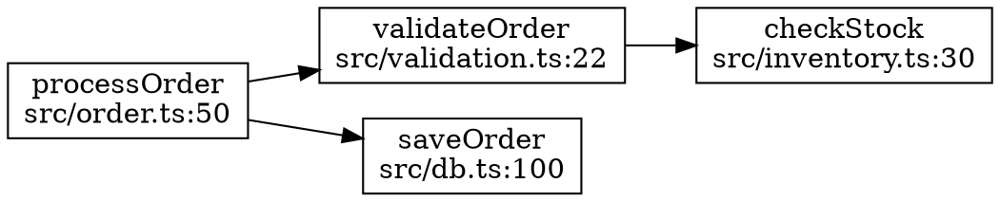

# Epic 16: Call Graph Tracing

**Status**: 🟢 Completed

## Description

Add call graph tracing commands to find function callers, callees, and build complete call graphs.

```bash
codescope trace callers "processOrder"      # Who calls this function
codescope trace callees "processOrder"      # Who this function calls
codescope trace graph "processOrder" --depth 3  # Complete call graph
codescope trace graph "processOrder" --format dot  # Graphviz export
```

Output: JSONL by default (AI-friendly), DOT option for visualization.

## Decisions

- **Resolution**: Follow imports (precise, cross-file)
- **Languages**: All from v1
- **Formats**: JSONL (default) + Graphviz DOT

---

## Architecture

```
┌─────────────────┐     ┌──────────────────┐     ┌─────────────────┐
│  codescope-cli  │────▶│  codescope-core  │────▶│ codescope-parser│
│  trace command  │     │  CallGraphService│     │ + call extraction│
└─────────────────┘     └──────────────────┘     └─────────────────┘
                               │
                               ▼
                        ┌──────────────────┐
                        │ codescope-search │
                        │ + call_sites tbl │
                        └──────────────────┘
```

---

## Tickets

### 16.1 Call Site Extraction 🟢

**Status**: Completed

**Files:**
- `crates/codescope-parser/src/call_site.rs` (new)
- `crates/codescope-parser/src/parser.rs` (modify)
- `crates/codescope-parser/src/lib.rs` (export)

**Tasks:**
- [ ] Create `CallSite` struct with callee_name, line, column, is_method, receiver
- [ ] Extract `call_expression` nodes for each language:
  - JS/TS: `call_expression` → `function` child
  - Python: `call` → `function` child
  - Rust: `call_expression`, `method_call_expression`
  - Java: `method_invocation`
  - Go: `call_expression`
  - C/C++: `call_expression`
- [ ] Return `Vec<CallSite>` with each `Chunk`

---

### 16.2 Import Extraction 🟢

**Status**: Completed

**Files:**
- `crates/codescope-parser/src/import.rs` (new)
- `crates/codescope-parser/src/parser.rs` (modify)

**Tasks:**
- [ ] Create `Import` struct with source, symbols, alias, is_default
- [ ] Extract imports for each language:
  - JS/TS: `import_statement`, `require` calls
  - Python: `import_statement`, `import_from_statement`
  - Rust: `use_declaration`
  - Java: `import_declaration`
  - Go: `import_declaration`
  - C/C++: `#include` (preproc_include)

---

### 16.3 SQLite Schema + Storage 🟢

**Status**: Completed

**Files:**
- `crates/codescope-search/src/storage.rs`

**New tables:**
```sql
-- Imports per file
CREATE TABLE imports (
    import_id INTEGER PRIMARY KEY,
    file_id INTEGER NOT NULL REFERENCES files(file_id) ON DELETE CASCADE,
    source TEXT NOT NULL,
    symbol TEXT,
    alias TEXT,
    is_default INTEGER DEFAULT 0
);
CREATE INDEX idx_imports_file ON imports(file_id);
CREATE INDEX idx_imports_symbol ON imports(symbol);

-- Call sites
CREATE TABLE call_sites (
    call_id INTEGER PRIMARY KEY,
    caller_chunk_id INTEGER NOT NULL REFERENCES chunks(chunk_id) ON DELETE CASCADE,
    callee_name TEXT NOT NULL,
    resolved_chunk_id INTEGER REFERENCES chunks(chunk_id),
    line INTEGER NOT NULL,
    column INTEGER,
    is_method INTEGER DEFAULT 0,
    receiver TEXT
);
CREATE INDEX idx_calls_caller ON call_sites(caller_chunk_id);
CREATE INDEX idx_calls_callee ON call_sites(callee_name);
CREATE INDEX idx_calls_resolved ON call_sites(resolved_chunk_id);
```

**API:**
- [ ] `insert_import(file_id, import)`
- [ ] `insert_call_site(caller_chunk_id, call)`
- [ ] `resolve_call_sites(file_id)` - batch resolution
- [ ] `get_callers(symbol)` → `Vec<CallerInfo>`
- [ ] `get_callees(chunk_id)` → `Vec<CalleeInfo>`

---

### 16.4 Resolution Service 🟢

**Status**: Completed

**Files:**
- `crates/codescope-core/src/call_graph.rs` (new)
- `crates/codescope-core/src/lib.rs` (export)

**Tasks:**
- [ ] Symbol resolution:
  - Search in same file
  - Follow imports to find definition
  - Handle re-exports
- [ ] Call graph construction:
  - `CallGraph::callers(storage, symbol)`
  - `CallGraph::callees(storage, symbol)`
  - `CallGraph::build(storage, symbol, depth)`
  - `CallGraph::to_jsonl()`
  - `CallGraph::to_dot()`

---

### 16.5 CLI `trace` Command 🟢

**Status**: Completed

**Files:**
- `crates/codescope-cli/src/commands/trace.rs` (new)
- `crates/codescope-cli/src/commands/mod.rs`
- `crates/codescope-cli/src/main.rs`

**Commands:**
```rust
#[derive(Subcommand)]
enum TraceCommand {
    Callers { symbol: String, file: Option<PathBuf> },
    Callees { symbol: String, file: Option<PathBuf> },
    Graph { symbol: String, depth: usize, format: OutputFormat },
}
```

---

### 16.6 Indexing Integration 🟢

**Status**: Completed

**Files:**
- `crates/codescope-cli/src/commands/index.rs`

**Tasks:**
- [ ] Extract imports + call sites during indexing
- [ ] Store in new tables
- [ ] Resolve call sites after full indexing

---

### 16.7 Tests + Documentation 🟢

**Status**: Completed

**Tests:**
- [ ] Unit tests for each language (call site extraction)
- [ ] Integration tests (callers/callees on fixture project)
- [ ] DOT format test

**Documentation:**
- [ ] `docs/cli.md` - Add `trace` section
- [ ] JSONL and DOT examples

---

## Output Formats

### JSONL (default)

```jsonl
{"type":"caller","symbol":"handleRequest","file":"src/api.ts","line":42,"column":10}
{"type":"caller","symbol":"processWebhook","file":"src/webhook.ts","line":18,"column":5}
```

```jsonl
{"type":"node","id":1,"symbol":"processOrder","file":"src/order.ts","line":50,"depth":0}
{"type":"edge","from":1,"to":2,"call_line":55}
{"type":"node","id":2,"symbol":"validateOrder","file":"src/validation.ts","line":22,"depth":1}
```

### Graphviz DOT



---

## Verification

1. **Build**: `cargo build`
2. **Tests**: `cargo test -p codescope-parser -p codescope-search`
3. **Manual**:
   ```bash
   cd test-project
   codescope clean && codescope index
   codescope trace callers "processOrder"
   codescope trace callees "processOrder"
   codescope trace graph "processOrder" --depth 2
   codescope trace graph "processOrder" --format dot > graph.dot
   dot -Tpng graph.dot -o graph.png
   ```

---

## Implementation Order

1. Ticket 16.1 (call sites) + Ticket 16.2 (imports) - Parser
2. Ticket 16.3 (storage) - Database
3. Ticket 16.4 (resolution) - Core logic
4. Ticket 16.6 (indexing) - Wire everything
5. Ticket 16.5 (CLI) - User interface
6. Ticket 16.7 (tests/docs) - Polish

---

## Deliverables

- [ ] `codescope trace callers` works for all languages
- [ ] `codescope trace callees` works for all languages
- [ ] `codescope trace graph` with depth limit
- [ ] JSONL and DOT output formats
- [ ] Cross-file resolution via imports
